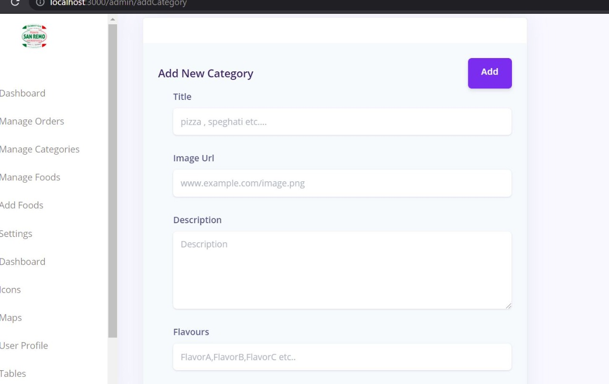
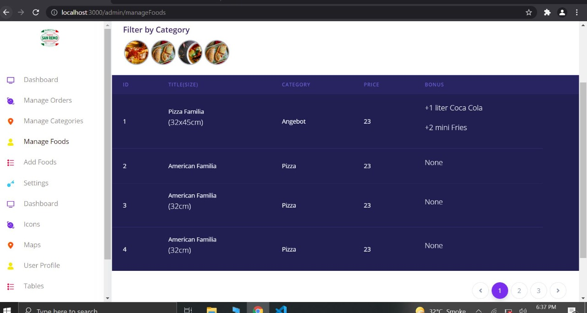
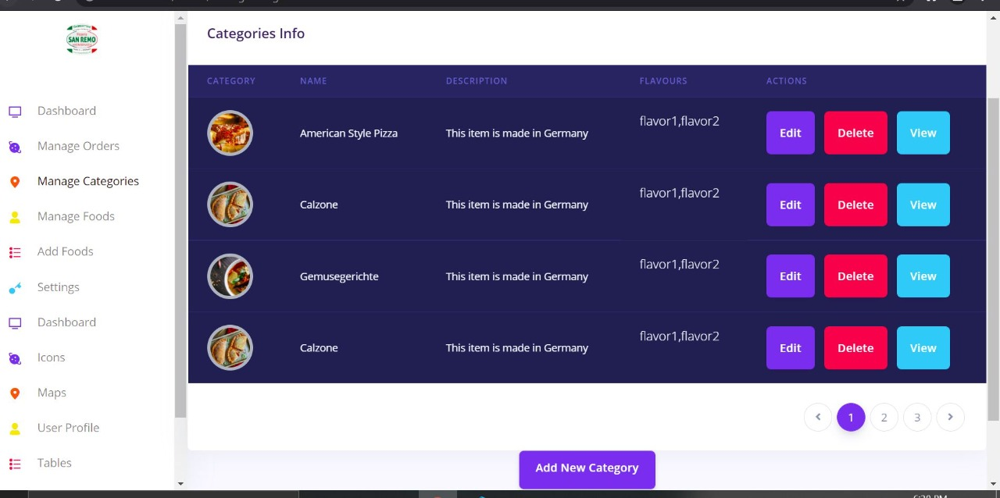

###  A Full Stack Hotel Managaement System Using Next JS and Node JS

##### Buidling Blocks
  - Next Js
  - React Redux
  - Material Ui
  - Pure CSS
  - Node Js API
  - React Hooks
  - Styled Componenents
  - Fortawesome/fontawesome-free
  - axios
  - chart.js
  - nouislider
  - React-chartjs-2
  - React-select
  - React-Star-Ratings
  
### Project illustration
    A few Screenshots of the Project Looks Like the following ones :
### 
 
###
 
###
 


  
  
##### Dependencies
```
"dependencies": {
    "@atlaskit/icon": "^21.8.1",
    "@atlaskit/page": "^12.0.7",
    "@atlaskit/tooltip": "^17.4.1",
    "@fortawesome/fontawesome-free": "5.15.2",
    "@zeit/next-css": "1.0.1",
    "@zeit/next-sass": "1.0.1",
    "axios": "^0.21.4",
    "bootstrap": "4.6.0",
    "chart.js": "2.9.4",
    "classnames": "2.2.6",
    "moment": "2.29.1",
    "next": "^10.2.3",
    "next-compose-plugins": "2.2.1",
    "next-fonts": "1.4.0",
    "next-images": "1.3.1",
    "node-sass": "4.14.1",
    "node-sass-package-importer": "5.3.2",
    "nouislider": "14.6.3",
    "path": "0.12.7",
    "react": "17.0.1",
    "react-chartjs-2": "2.11.1",
    "react-copy-to-clipboard": "5.0.3",
    "react-datetime": "3.0.4",
    "react-dom": "17.0.1",
    "react-redux": "^7.2.5",
    "react-select": "^4.3.1",
    "react-star-ratings": "^2.3.0",
    "reactstrap": "8.9.0",
    "redux": "^4.1.1",
    "redux-thunk": "^2.3.0",
    "socket.io-client": "^4.2.0",
    "styled-components": "^5.3.1",
    "webpack": "4.44.1"
  }
  
```

---
Description: Get started with Next.js in the official documentation, and learn more about all our features!
---

# Getting Started

Welcome to the Next.js documentation!

If you're new to Next.js we recommend that you start with the [learn course](https://nextjs.org/learn/basics/create-nextjs-app).

The interactive course with quizzes will guide you through everything you need to know to use Next.js.

If you have questions about anything related to Next.js, you're always welcome to ask our community on [GitHub Discussions](https://github.com/vercel/next.js/discussions).

#### System Requirements

- [Node.js 12.22.0](https://nodejs.org/) or later
- MacOS, Windows (including WSL), and Linux are supported

## Setup

We recommend creating a new Next.js app using `create-next-app`, which sets up everything automatically for you. To create a project, run:

```bash
npx create-next-app@latest
# or
yarn create next-app
```

If you want to start with a TypeScript project you can use the `--typescript` flag:

```bash
npx create-next-app@latest --typescript
# or
yarn create next-app --typescript
```

After the installation is complete:

- Run `npm run dev` or `yarn dev` to start the development server on `http://localhost:3000`.
- Visit `http://localhost:3000` to view your application.
- Edit `pages/index.js` and see the updated result in your browser.

For more information on how to use `create-next-app`, you can review the [`create-next-app` documentation](/docs/api-reference/create-next-app.md)

## Manual Setup

Install `next`, `react` and `react-dom` in your project:

```bash
npm install next react react-dom
# or
yarn add next react react-dom
```

Open `package.json` and add the following `scripts`:

```json
"scripts": {
  "dev": "next dev",
  "build": "next build",
  "start": "next start",
  "lint": "next lint"
}
```

These scripts refer to the different stages of developing an application:

- `dev` - Runs [`next dev`](/docs/api-reference/cli.md#development) which starts Next.js in development mode
- `build` - Runs [`next build`](/docs/api-reference/cli.md#build) which builds the application for production usage
- `start` - Runs [`next start`](/docs/api-reference/cli.md#production) which starts a Next.js production server
- `lint` - Runs [`next lint`](/docs/api-reference/cli.md#lint) which sets up Next.js' built-in ESLint configuration

Next.js is built around the concept of [pages](/docs/basic-features/pages.md). A page is a [React Component](https://reactjs.org/docs/components-and-props.html) exported from a `.js`, `.jsx`, `.ts`, or `.tsx` file in the `pages` directory.

Pages are associated with a route based on their file name. For example `pages/about.js` is mapped to `/about`. You can even add dynamic route parameters with the filename.

Create a `pages` directory inside your project.

Populate `./pages/index.js` with the following contents:

```jsx
function HomePage() {
  return <div>Welcome to Next.js!</div>
}

export default HomePage
```

So far, we get:

- Automatic compilation and bundling (with webpack and babel)
- [React Fast Refresh](https://nextjs.org/blog/next-9-4#fast-refresh)
- [Static generation and server-side rendering](/docs/basic-features/data-fetching/overview.md) of [`./pages/`](/docs/basic-features/pages.md)
- [Static file serving](/docs/basic-features/static-file-serving.md). `./public/` is mapped to `/`

In addition, any Next.js application is ready for production from the start, read more in our [Deployment documentation](/docs/deployment.md).

## Related

For more information on what to do next, we recommend the following sections:

<div class="card">
  <a href="/docs/basic-features/pages.md">
    <b>Pages:</b>
    <small>Learn more about what pages are in Next.js.</small>
  </a>
</div>

<div class="card">
  <a href="/docs/basic-features/built-in-css-support.md">
    <b>CSS Support:</b>
    <small>Use the built-in CSS support to add custom styles to your app.</small>
  </a>
</div>

<div class="card">
  <a href="/docs/api-reference/cli.md">
    <b>CLI:</b>
    <small>Learn more about the Next.js CLI.</small>
  </a>
</div>
